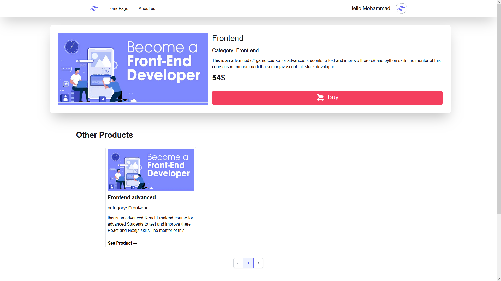

# Project

Shopy is a real project used [NextJS](https://nextjs.org/), [TypeScript(ts)](https://www.typescriptlang.org/), and many other technologies that if you want to know you can read Technologies part with scrolling down.

# See Online
This project is deployed on [vercel](https://vercel.com) to see it online with out need to clone it and start it.
The project is available in https://shopy-js.vercel.app for you.

# Screen shots
## Index page

## Product page

## Admin panel

## Sign up form

## update form

# Installation

 If you want to install and change my code for yourself you can clone it form https://github.com/mohammad-mohammadi88/Shopy with command `git clone https://github.com/mohammad-mohammadi88/Shopy` and install node_modules with commands like
 
	npm i -> npm install
	#or
	pnpm i -> pnpm install
	#or
	yarn

# Development
To start development service you can run one of the commands below

    npm run dev
    #or
    pnpm dev
    #or
    yarn dev
   then you can see the local Shopy on http://localhost:3000.

# Technologies
We used modern technologies such as
[React](https://react.dev) => as main technology for creating UI.
[NextJS](https://nextjs.org) => for SSR and ISR for better SEO.
[TypeScript](https://www.typescriptlang.org) => for writing cleaner and more understandable codes.
[Formik](https://formik.org) & [Yup](https://yup-docs.vercel.app/docs/intro) => for validating forms.
[React Toastify](https://fkhadra.github.io/react-toastify/introduction) => to show interesting messages for better UI.
[React Query](https://tanstack.com/query/latest/docs/framework/react/overview) => for handling fetch requests.
[axios](https://axios-http.com)  => sending CRUD requests.

# server

The server is and online server deployed on [render](https://render.com) to make shopy an full online website without any dependency for cloning and starting any code.
The server is available in https://shopy-server-auqj.onrender.com.
You can send some requests to this url.

# conclusion
Shopy is a real project with forms and admin panel.
You can get my code for free to work with it and even improve it.
I'll be glad if you send me your point of view in github